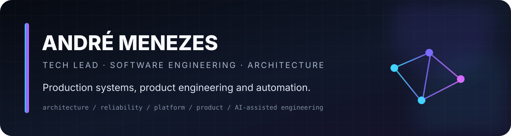
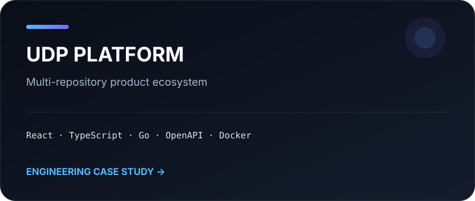
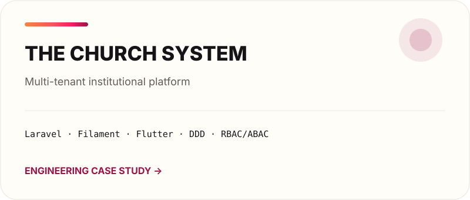

  

  

  <strong>Tech Lead · Software Engineering · Architecture · Product Engineering</strong> 
  Building production-oriented platforms, automation systems and digital products.

  

  <code>TypeScript</code> · <code>React</code> · <code>Node.js</code> · <code>Go</code> · <code>Python</code> · <code>PHP</code> · <code>Docker</code> · <code>PostgreSQL</code>

---

## Selected engineering work

The production source for the systems below is private. The case studies expose the part that matters for technical evaluation: **architecture, constraints, engineering decisions, quality strategy and trade-offs — without publishing proprietary code or sensitive operational details.**

<table>
<tr>
<td width="50%" valign="top">

**Lead acquisition & operations platform**

Local-first platform for multi-source acquisition, identity resolution, campaign operations, research, human review and omnichannel engagement.

FastAPI · PostgreSQL/PostGIS · Workers · Docker · Adapters

→ [Engineering case study](./case-studies/captador-de-leads.md)
</td>
<td width="50%" valign="top">

**Digital experience & commercial platform**

Componentized frontend architecture with design tokens, controlled motion, architectural gates, automated tests and deployment targets for staging and static hosting.

Astro · React · TypeScript · Tailwind · GSAP · Playwright

→ [Engineering case study](./case-studies/acsmti.md)
</td>
</tr>
<tr>
<td width="50%" valign="top">

**Multi-repository product ecosystem**

Contract-driven platform combining web, BFF, owner services, microservices and mobile surfaces behind a Docker-first development environment.

React · TypeScript · Go · OpenAPI · Docker · Mobile

→ [Engineering case study](./case-studies/udp.md)
</td>
<td width="50%" valign="top">

**Multi-tenant institutional platform**

Modular system designed around bounded contexts, authorization, privacy, observability and cross-platform consistency across backoffice, web and mobile.

Laravel · Filament · Flutter · DDD · RBAC/ABAC · Docker

→ [Engineering case study](./case-studies/the-church-system.md)
</td>
</tr>
</table>

---

## Engineering focus

<table>
<tr>
<td valign="top"><strong>Architecture</strong>  Bounded contexts, modularity, explicit contracts, event-oriented workflows, adapter boundaries and deliberate trade-offs.</td>
<td valign="top"><strong>Reliability</strong>  Automated validation, test strategy, idempotency, observability, recovery paths and operational guardrails.</td>
<td valign="top"><strong>Product engineering</strong>  Architecture connected to user journeys, delivery constraints, maintainability and measurable product outcomes.</td>
</tr>
<tr>
<td valign="top"><strong>Platform</strong>  Docker-first environments, CI/CD gates, versioning, release discipline and reproducible development workflows.</td>
<td valign="top"><strong>Security & privacy</strong>  Least exposure, explicit authorization, data boundaries, secret hygiene and privacy-aware design.</td>
<td valign="top"><strong>AI-assisted engineering</strong>  Structured specifications, durable project context, validation loops and machine-readable engineering governance.</td>
</tr>
</table>

## Source strategy

Current commercial systems remain private. This profile is deliberately curated around **engineering evidence instead of repository volume**. Public source is added when it represents the same quality bar as the case studies above.

## Private source, public evidence

Commercial and sensitive repositories remain private by design. Public case studies are generated from a strict disclosure boundary:

    private source
          │
          ▼
    explicit public portfolio material
          │
          ▼
    secret / sensitive-pattern validation
          │
          ▼
    public engineering case study

This repository includes a validation workflow that rejects common secret patterns before portfolio material is merged.

→ [Disclosure model](./docs/private-to-public.md)

---

Profile repository maintained as an engineering portfolio. Case studies describe systems at a high level and intentionally omit proprietary source code, credentials, private endpoints, customer data and internal operational details. Visual language follows the <a href="./docs/visual-system.md">ACSMTI design system</a>.
