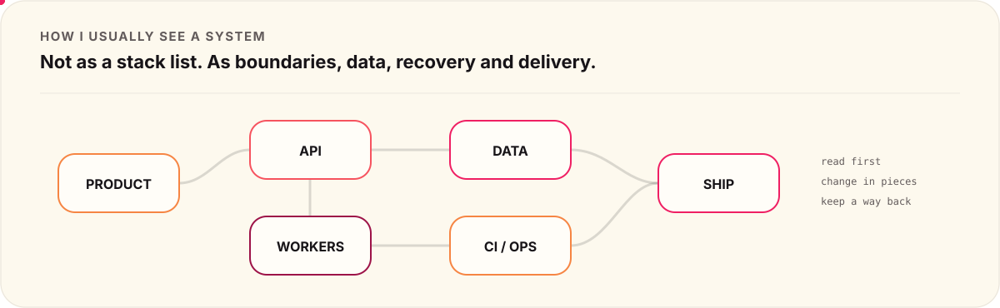

<picture>
  <source media="(prefers-color-scheme: dark)" srcset="./assets/hero-dark.svg">
  <source media="(prefers-color-scheme: light)" srcset="./assets/hero-light.svg">
  
</picture>

  <a href="https://acsmti.com">acsmti.com</a>
  &nbsp;·&nbsp;
  <a href="https://www.linkedin.com/in/andrecsmenezes">LinkedIn</a>
  &nbsp;·&nbsp;
  <a href="mailto:andre.cs.menezes@gmail.com">Email</a>

I've been building for the web since the early 2000s. **PHP/Laravel is where I have the deepest production mileage**, but I have spent years working across JavaScript/TypeScript, Node.js, Vue/React, SQL, APIs, Docker, CI/CD and AWS.

Most of my work is not greenfield. There is usually code, data, users and something that cannot stop. I prefer to **read the system first, find the risky parts, change it in pieces and keep a way back**.

I also do not believe much in architecture that only exists in a diagram. If a boundary matters, I want to see it in code, contracts, tests, CI or the way the system is operated.

<picture>
  <source media="(prefers-color-scheme: dark)" srcset="./assets/systems-dark.svg">
  <source media="(prefers-color-scheme: light)" srcset="./assets/systems-light.svg">
  
</picture>

## What I'm building now

Most of these repositories are private. The source stays private; the useful engineering context does not.

<table>
<tr>
<td width="50%" valign="top">
<a href="./case-studies/captador-de-leads.md">
<picture>
  <source media="(prefers-color-scheme: dark)" srcset="./assets/captador-dark.svg">
  <source media="(prefers-color-scheme: light)" srcset="./assets/captador-light.svg">
  
</picture>
</a>

Acquisition, identity, research, campaigns, approval and outreach in one operational flow.

**[Open the case study →](./case-studies/captador-de-leads.md)**
</td>
<td width="50%" valign="top">
<a href="./case-studies/acsmti.md">
<picture>
  <source media="(prefers-color-scheme: dark)" srcset="./assets/acsmti-dark.svg">
  <source media="(prefers-color-scheme: light)" srcset="./assets/acsmti-light.svg">
  
</picture>
</a>

A motion-heavy commercial site without turning the frontend into a pile of one-off CSS.

**[Open the case study →](./case-studies/acsmti.md)**
</td>
</tr>
<tr>
<td width="50%" valign="top">
<a href="./case-studies/udp.md">
<picture>
  <source media="(prefers-color-scheme: dark)" srcset="./assets/udp-dark.svg">
  <source media="(prefers-color-scheme: light)" srcset="./assets/udp-light.svg">
  
</picture>
</a>

Several runtimes and repositories kept together by contracts, ownership and a Docker-first platform.

**[Open the case study →](./case-studies/udp.md)**
</td>
<td width="50%" valign="top">
<a href="./case-studies/the-church-system.md">
<picture>
  <source media="(prefers-color-scheme: dark)" srcset="./assets/thechurchsys-dark.svg">
  <source media="(prefers-color-scheme: light)" srcset="./assets/thechurchsys-light.svg">
  
</picture>
</a>

Tenancy, authorization, privacy and day-to-day operations across backoffice, web and mobile.

**[Open the case study →](./case-studies/the-church-system.md)**
</td>
</tr>
</table>

## This account is only part of the story

Some of the strongest systems I worked on live in company/client repositories or older infrastructure, so they will never appear in the repository list below.

<picture>
  <source media="(prefers-color-scheme: dark)" srcset="./assets/career-dark.svg">
  <source media="(prefers-color-scheme: light)" srcset="./assets/career-light.svg">
  
</picture>

A few examples:

- a **4M+ user platform modernization**, moving incrementally from PHP legacy toward Node.js/TypeScript + Vue/TypeScript with a team of six;
- the **Subway franchise platform**, including a visual editor and graphic-production flow;
- healthcare work at **Clinicarx**, marketplace/payment work at **TROC/Monest**, pricing architecture at **Teros** and **Open Finance** work at FCamara;
- a **telemedicine/video-call product** using Vue, React and Twilio;
- **Brazilian Outlets / Sarah / Brazipay**, mixing marketplace, payments, WhatsApp, automation, CI/CD and AWS;
- **SISAP / SPRO / NTT**, keeping a PHP 5.x + MySQL critical legacy system running while delivering 30+ evolutions and SAP Business One integrations.
- internal work such as a queue-based **WhatsApp Service** and **DPLMS**, an engineering audit/refactoring workflow built around repeated find → fix → validate loops.

**[Read the work that does not live under this GitHub →](./docs/work-beyond-github.md)**

## How I tend to work

- **Read before rewriting.** I want the real dependency map, not the one everybody remembers.
- **Do not replace legacy just because it is old.** Change the part that hurts, measure it and keep the system running.
- **Put risky work behind tests, logs and a rollback path.**
- **If a rule matters, automate the check.** CI is better than a document nobody remembers to read.
- **Keep technical decisions close to the code.** ADRs, contracts and short documentation age better than giant handbooks.
- **Use AI as part of the engineering loop, not as an excuse to skip verification.**

## GitHub, in motion

<picture>
  <source media="(prefers-color-scheme: dark)" srcset="./generated/activity-dark.svg">
  <source media="(prefers-color-scheme: light)" srcset="./generated/activity-light.svg">
  
</picture>

<picture>
  <source media="(prefers-color-scheme: dark)" srcset="https://raw.githubusercontent.com/andrecsmenezes/andrecsmenezes/output/contribution-snake-dark.svg">
  <source media="(prefers-color-scheme: light)" srcset="https://raw.githubusercontent.com/andrecsmenezes/andrecsmenezes/output/contribution-snake-light.svg">
  
</picture>

Both are rebuilt automatically. Private contribution counts can appear when GitHub exposes them publicly; repository names and private details do not.

## Code you can open

### [package-unifier](https://github.com/andrecsmenezes/package-unifier)

A WordPress/Composer dependency-management experiment. It is public on purpose: the README explains the idea **and where the current implementation falls short**.

## About the private repos

Private code stays private. The case studies only expose material I deliberately chose to make public, and this profile has a CI guard for common secret patterns, unexpected file types and broken local references.

[How the disclosure boundary works →](./docs/private-to-public.md)

---

  
  
  

