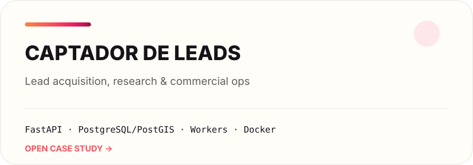
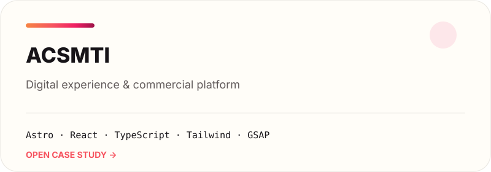
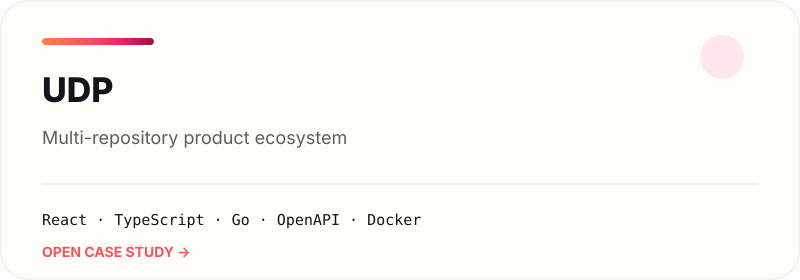
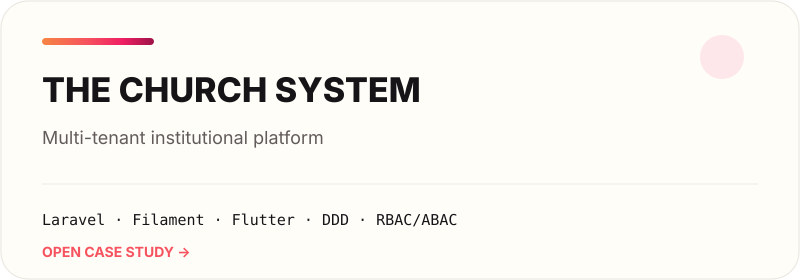

<picture>
  <source media="(prefers-color-scheme: dark)" srcset="./assets/hero-dark.svg">
  <source media="(prefers-color-scheme: light)" srcset="./assets/hero-light.svg">
  
</picture>

  <a href="https://acsmti.com">acsmti.com</a>
  &nbsp;·&nbsp;
  <a href="https://www.linkedin.com/in/andrecsmenezes">LinkedIn</a>
  &nbsp;·&nbsp;
  <a href="mailto:andre.cs.menezes@gmail.com">Email</a>

### Hi, I'm André.

I build software products and the systems behind them.

I like work that starts messy: an old system, a manual process, a product that grew faster than its architecture. My job is to make it easier to understand, safer to change and simpler to ship.

Most of what I'm building right now is private. The source stays private; the engineering doesn't have to. I publish the decisions, diagrams, tests and trade-offs I can share without exposing the product.

<picture>
  <source media="(prefers-color-scheme: dark)" srcset="./assets/now-dark.svg">
  <source media="(prefers-color-scheme: light)" srcset="./assets/now-light.svg">
  
</picture>

## What I'm building

<table>
<tr>
<td width="50%" valign="top">
<a href="./case-studies/captador-de-leads.md">
<picture>
  <source media="(prefers-color-scheme: dark)" srcset="./assets/captador-dark.svg">
  <source media="(prefers-color-scheme: light)" srcset="./assets/captador-light.svg">
  
</picture>
</a>

Acquisition, identity, research, campaigns, approval and outreach in one operational flow.

**[Open the case study →](./case-studies/captador-de-leads.md)**
</td>
<td width="50%" valign="top">
<a href="./case-studies/acsmti.md">
<picture>
  <source media="(prefers-color-scheme: dark)" srcset="./assets/acsmti-dark.svg">
  <source media="(prefers-color-scheme: light)" srcset="./assets/acsmti-light.svg">
  
</picture>
</a>

A motion-heavy commercial site without turning the frontend into a pile of one-off CSS.

**[Open the case study →](./case-studies/acsmti.md)**
</td>
</tr>
<tr>
<td width="50%" valign="top">
<a href="./case-studies/udp.md">
<picture>
  <source media="(prefers-color-scheme: dark)" srcset="./assets/udp-dark.svg">
  <source media="(prefers-color-scheme: light)" srcset="./assets/udp-light.svg">
  
</picture>
</a>

Several runtimes and repositories kept together by contracts, ownership and a Docker-first platform.

**[Open the case study →](./case-studies/udp.md)**
</td>
<td width="50%" valign="top">
<a href="./case-studies/the-church-system.md">
<picture>
  <source media="(prefers-color-scheme: dark)" srcset="./assets/thechurchsys-dark.svg">
  <source media="(prefers-color-scheme: light)" srcset="./assets/thechurchsys-light.svg">
  
</picture>
</a>

Tenancy, authorization, privacy and day-to-day operations across backoffice, web and mobile.

**[Open the case study →](./case-studies/the-church-system.md)**
</td>
</tr>
</table>

## A few rules I work by

- **If a boundary matters, name it.** Hidden architecture eventually becomes expensive architecture.
- **If a rule matters, put it in CI.** A convention nobody checks is just a suggestion.
- **Automate repetition, not accountability.** Critical decisions should still have an owner.
- **Docs have to survive the next release.** Otherwise they are decoration.

## GitHub, in motion

<picture>
  <source media="(prefers-color-scheme: dark)" srcset="./generated/activity-dark.svg">
  <source media="(prefers-color-scheme: light)" srcset="./generated/activity-light.svg">
  
</picture>

<picture>
  <source media="(prefers-color-scheme: dark)" srcset="https://raw.githubusercontent.com/andrecsmenezes/andrecsmenezes/output/contribution-snake-dark.svg">
  <source media="(prefers-color-scheme: light)" srcset="https://raw.githubusercontent.com/andrecsmenezes/andrecsmenezes/output/contribution-snake-light.svg">
  
</picture>

Both are rebuilt every day from GitHub activity. Private contribution counts can appear here when GitHub exposes them publicly; repository names and private details do not.

## Code you can open

### [package-unifier](https://github.com/andrecsmenezes/package-unifier)

A WordPress/Composer dependency-management experiment. It is public on purpose: the README explains both the idea **and where the current implementation falls short**.

## About the private repos

Private code stays private. The case studies only expose material I have deliberately chosen to make public, and this profile has a CI guard for common secret patterns, unexpected file types and broken local references.

[How the disclosure boundary works →](./docs/private-to-public.md)

---

  
  
  

