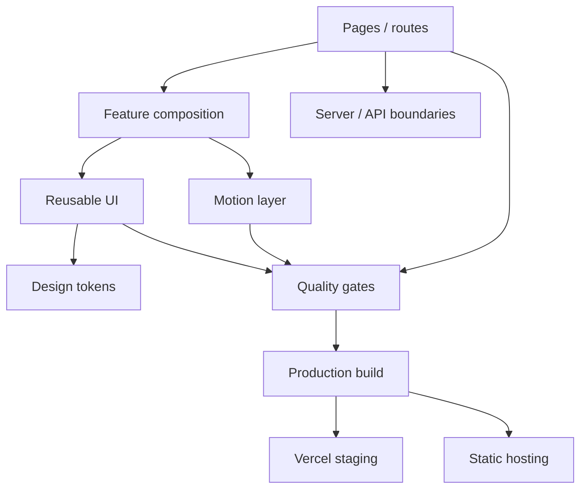

# ACSMTI

> Source code is private. The live site and the engineering decisions are the public part.

## The problem I care about here

A polished website is easy to make impressive once.

Keeping it fast, responsive and maintainable after the tenth visual experiment is the harder part.

ACSMTI is where I am pushing both sides at the same time: a more expressive visual experience, without letting animation and page-specific CSS take over the codebase.

## The shape of the frontend

## Decisions that mattered

### UI primitives are not page markup

Reusable React/TypeScript pieces live separately from route composition. A page can use the system; it should not become the system.

### The palette lives in tokens

The ACSMTI colors, spacing, radii and breakpoints have a canonical source. That is why this GitHub profile can use the same visual language without sampling colors from screenshots.

### Motion has an owner

GSAP is feature-scoped. Animation is allowed to be rich, but it should not create global state nobody understands three months later.

### CI checks architecture too

Linting is useful, but it cannot tell me that a boundary has been bypassed. The pipeline also runs architecture checks, types, unit tests, production builds, browser tests, dependency audits and artifact smoke checks.

### Staging and final hosting are different environments

Vercel is useful for staging and server-backed endpoints. The final static hosting target has different constraints. The code has to know that instead of pretending both environments are identical.

## Stack

Astro · React · TypeScript · Tailwind CSS · GSAP · Vitest · Playwright

## Live

[acsmti.com →](https://acsmti.com)

---

[← Back to profile](../README.md) · [How private material is kept out](../docs/private-to-public.md)
