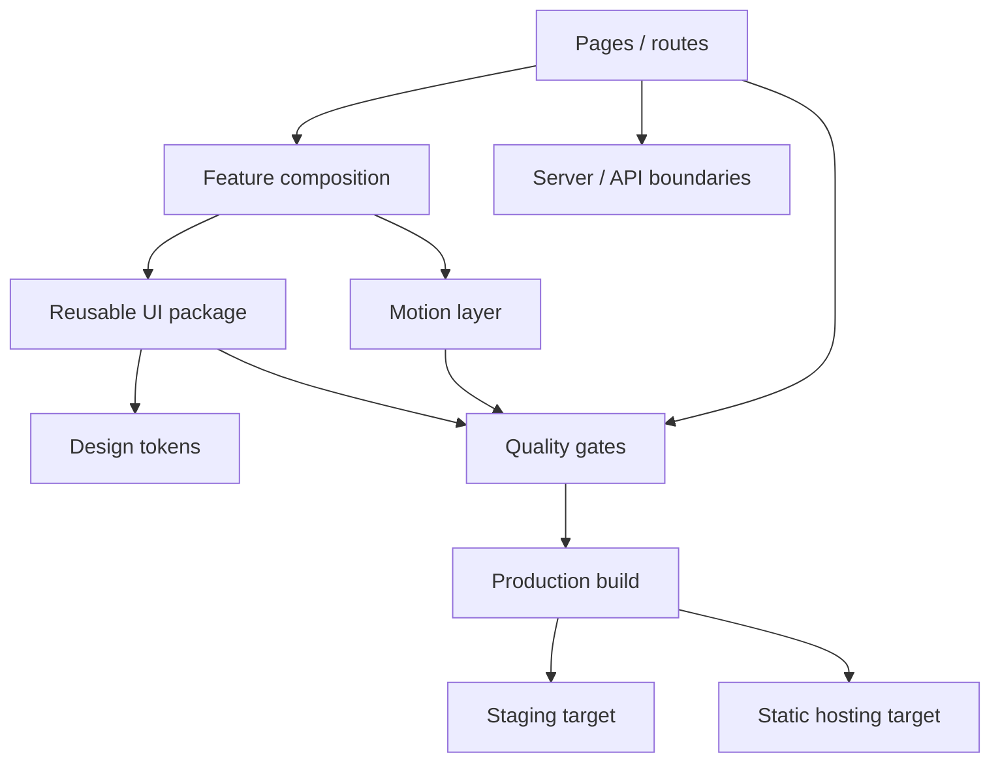

# ACSMTI

> **Private production source · Public engineering case study**

## Context

A commercial digital-experience platform designed to combine high-end interaction, strong responsive behavior and maintainable frontend architecture. The implementation separates reusable UI primitives from page composition and treats motion, design tokens and deployment constraints as first-class engineering concerns.

## Architecture at a glance

## Engineering decisions

### UI as a reusable system
React/TypeScript primitives live separately from route/page composition. This reduces page-specific duplication and makes visual rules easier to validate consistently.

### Design tokens before ad-hoc CSS
Visual decisions are represented through tokens and Tailwind-based composition rather than accumulating isolated CSS patches.

### Motion is feature-scoped
GSAP is used deliberately and encapsulated by feature. Animation does not become an uncontrolled global side effect.

### Architectural gates are executable
CI includes architecture checks alongside linting, type validation, unit tests, production build, end-to-end tests, dependency auditing and artifact smoke checks.

### Deployment targets are explicit
The application distinguishes staging/server-capable behavior from a static-hosting production target, with fallbacks for functionality that depends on dynamic endpoints.

## Quality strategy

- TypeScript static validation.
- Architecture-policy checks.
- ESLint with zero-warning expectation.
- Vitest unit tests.
- Playwright end-to-end and responsive validation.
- Dependency audit and production artifact smoke checks.

## Technology surface

Astro · React · TypeScript · Tailwind CSS · GSAP · Vitest · Playwright · CI/CD

## What this case demonstrates

- Balancing premium interaction with maintainable frontend boundaries.
- Treating responsive quality as product behavior, not a final CSS pass.
- Converting architecture rules into executable CI gates.
- Designing one codebase for materially different deployment environments.

---

[← Back to profile](../README.md) · [Disclosure model](../docs/private-to-public.md)