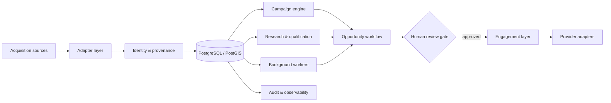

# Captador de Leads

> **Private production source · Public engineering case study**

## Context

A local-first platform for lead acquisition and commercial operations. What began as a single acquisition integration evolved into a broader system responsible for source ingestion, identity resolution, campaign state, research, qualification, opportunity evidence, human review and communication-provider integration.

The public case study intentionally describes **system boundaries and engineering decisions**, not proprietary source code, credentials, private endpoints, customer data or internal operating records.

## Architecture at a glance

## Engineering decisions

### PostgreSQL as the operational source of truth
Operational state is persisted rather than inferred from browser sessions or transient jobs. This supports reproducibility, provenance and safer recovery after interrupted work.

### Adapter boundaries around external providers
Acquisition and communication integrations sit behind explicit adapter contracts. Provider-specific mechanics do not become business-domain rules.

### Human-in-the-loop as a product constraint
The system can prepare evidence, contacts and drafts, but the final contact selection/readiness gate is explicit. Automation is used to reduce repetitive work without hiding consequential actions.

### Idempotent acquisition
Equivalent acquisition work is fingerprinted so recent successful captures can be reused rather than repeatedly creating duplicate work and duplicate data.

### Local-first, Docker-first runtime
Application services, persistence, workers and acquisition integrations are composed behind an isolated Docker network. The normal operator surface is intentionally smaller than the internal service topology.

## Reliability & safety

- Background work is persisted rather than existing only in memory.
- Provider failover is explicit; ambiguous messages are not silently resent through another channel.
- Validation distinguishes behavioral evidence from simple test-count inflation.
- Operational actions maintain provenance/audit records.
- Sensitive provider configuration is kept outside public portfolio material.

## Technology surface

FastAPI · Python · PostgreSQL/PostGIS · Node.js adapters · Docker · background workers · provider integrations · structured specifications

## What this case demonstrates

- Growing a single-purpose tool into a bounded platform without losing traceability.
- Designing for integration churn through adapters rather than provider coupling.
- Treating human approval as an architectural invariant.
- Combining product workflow, persistence, observability and recovery concerns.

---

[← Back to profile](../README.md) · [Disclosure model](../docs/private-to-public.md)