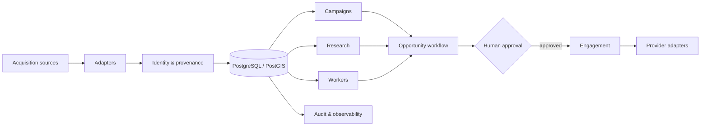

# Captador de Leads

> Source code is private. This page shows the parts I can discuss without exposing the product.

## Why I built it

Lead generation looks simple until it becomes operational.

Finding a company is one problem. Deciding whether it is the same company you found yesterday, keeping the source of every piece of data, researching it, deciding whether it is worth contacting and then coordinating outreach is a different system entirely.

The Captador grew around that second problem.

## The shape of the system

## Decisions that mattered

### PostgreSQL is the source of truth

Jobs can fail. Browsers close. Providers time out. Operational state therefore lives in the database, not in a chain of assumptions about what probably happened.

### Providers stay behind adapters

Search, messaging and enrichment vendors change. The product should not have to change with them. Provider-specific code stays at the edge; the core workflow speaks its own language.

### Human approval is not a temporary workaround

The system can collect evidence, prepare work and reduce repetition. It does not silently turn an uncertain lead into an outbound contact. That gate is deliberate.

### Acquisition has to be idempotent

Running the same search twice should not create two realities. Equivalent work is fingerprinted and recent successful results can be reused.

## What I watch closely

- duplicate identities and provenance;
- retries that accidentally become duplicate sends;
- background jobs that disappear without leaving evidence;
- provider failures leaking into product rules;
- automation that makes an important decision harder to see.

## Stack

FastAPI · Python · PostgreSQL/PostGIS · Node.js adapters · Docker · background workers

---

[← Back to profile](../README.md) · [How private material is kept out](../docs/private-to-public.md)
