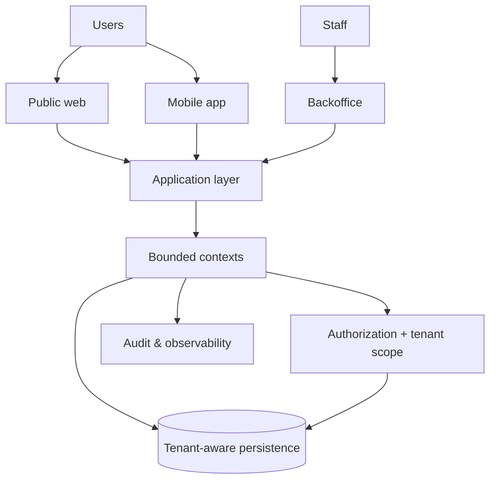

# The Church System

> Private source. Public architecture notes.

## Why this one is different

Multi-tenant software gets dangerous when tenancy, authorization and privacy are bolted on after the feature work.

The Church System has ordinary product concerns — backoffice, public web, mobile, workflows and reporting — but it also handles domains where access and confidentiality matter. Those constraints have to shape the architecture from the beginning.

## The shape of the system

## Decisions that mattered

### Tenant isolation is not a query filter

Tenant identity participates in authorization and data-access decisions. It cannot depend on every developer remembering to add one more `where` clause.

### Roles are only part of authorization

RBAC is useful, but some decisions also depend on tenant, ownership, scope and confidentiality. Those rules belong in the authorization model.

### Sensitive domains are named

Privacy, consent, retention and sensitive workflows are architecture topics in this project. Naming them makes them reviewable.

### Important decisions get an ADR

When a decision has a real trade-off, I want the next person to know why it was made before replacing it.

### Validation follows the current architecture

The v2 repository uses backend, web, architecture, security and OpenSpec CI gates. A merged commit is not evidence that pending or failed checks passed. The earlier standalone backend's test inventory is historical, not a current v2 test-count claim.

## Stack

PHP · Laravel · PostgreSQL · Redis · Svelte / SvelteKit · TypeScript · Docker · DDD · RBAC/ABAC · multi-tenancy

Flutter belongs to the planned mobile domain; Filament and Blade/Livewire belong to the superseded legacy implementation, not the active v2 stack.

---

[← Back to profile](../README.md) · [How private material is kept out](../docs/private-to-public.md)
