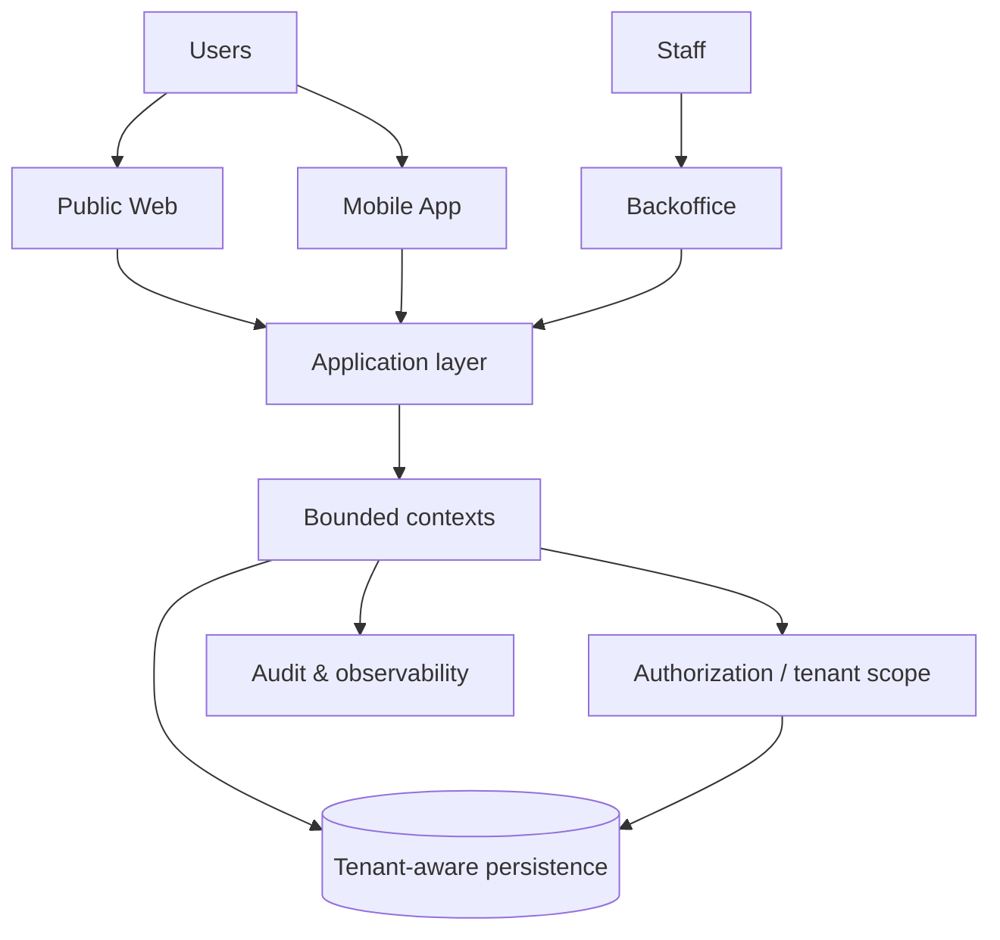

# The Church System

> **Private production source · Public engineering case study**

## Context

A modular, multi-tenant institutional platform spanning backoffice, public web and mobile experiences. Its architecture must handle ordinary operational workflows alongside privacy-sensitive domains, authorization boundaries and cross-platform consistency.

## Architecture at a glance

## Engineering decisions

### Multi-tenancy is an architectural concern
Tenant identity and isolation are part of authorization and data-access decisions rather than a cosmetic filtering layer.

### Bounded contexts over framework folders
Domain responsibilities are documented explicitly so modules can evolve around business capability instead of becoming one undifferentiated application.

### Authorization beyond simple roles
Role-based permissions are combined with contextual scope and ownership rules where required. Authorization decisions account for tenant boundaries and confidentiality.

### Privacy-sensitive domains are explicit
Privacy, retention, consent and sensitive workflows are documented as architecture topics. They are not delegated entirely to controller-level implementation.

### Architecture Decision Records
Material decisions are captured as ADRs so future changes can recover the original constraints and trade-offs instead of rediscovering them.

## Quality strategy

- Docker-first execution for application, migrations, seed and tests.
- Broad automated backend coverage complemented by smoke suites.
- Mobile contract/session validation.
- Health and observability endpoints.
- Documentation links implementation, architectural decisions and execution checklists.

## Technology surface

PHP · Laravel · Filament · Blade/Livewire · Flutter · Docker · DDD · RBAC/ABAC · multi-tenancy

## What this case demonstrates

- Designing authorization and tenancy together.
- Maintaining architectural coherence across web, backoffice and mobile.
- Treating privacy and retention as system design concerns.
- Using ADRs and durable documentation to support long-lived systems.

---

[← Back to profile](../README.md) · [Disclosure model](../docs/private-to-public.md)