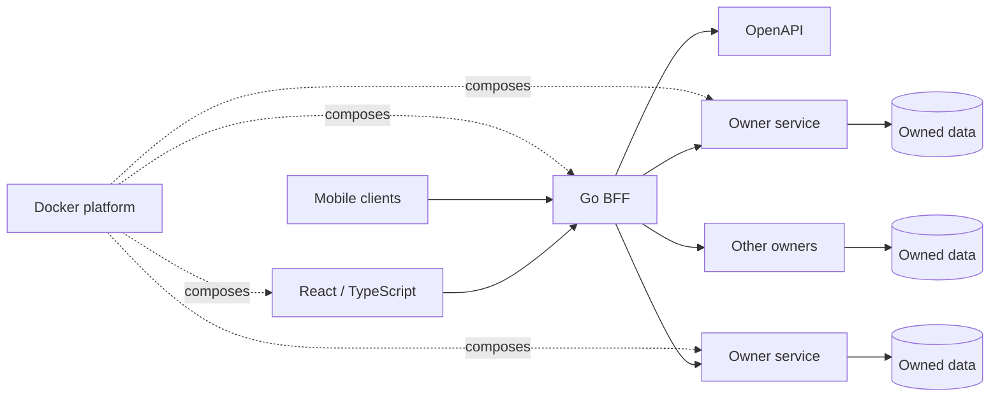

# UDP

> Private multi-repository product. Public case study.

## The hard part

Having several repositories is not architecture.

The real problem is knowing who owns each decision, which contract is authoritative and how a change moves through web, BFF, services and mobile without every layer inventing its own version of the product.

That is the part I care about in UDP.

## The shape of the system

## Decisions that keep it sane

### The browser talks to the BFF

The frontend does not reach into owner-service persistence and does not invent business data locally. The BFF is the product-facing boundary.

### OpenAPI is a contract, not decoration

Web, BFF and mobile clients are checked against an explicit contract. Generated clients and conformance checks make drift visible.

### Services own their data

Shared packages can solve shared technical problems. They do not become a shortcut around domain ownership.

### Docker is the local platform

The goal is a small host dependency set and the same runtime story on Windows, Linux and macOS. Language toolchains stay inside the platform where possible.

### Architecture needs memory

Repository maps, specifications and executable checks keep important decisions out of chat history and out of any one person's head.

## Stack

React · TypeScript · Go · OpenAPI · Docker Compose · mobile clients · microservices

---

[← Back to profile](../README.md) · [How private material is kept out](../docs/private-to-public.md)
