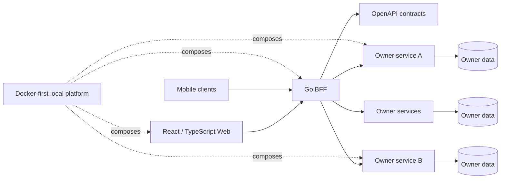

# UDP Platform

> **Private multi-repository source · Public engineering case study**

## Context

A product ecosystem organized across web, BFF, owner services, microservices, API contracts and mobile surfaces. The engineering challenge is not a single framework; it is maintaining coherent contracts and development workflows across several runtimes.

## Architecture at a glance

## Engineering decisions

### BFF as the browser-facing business boundary
The frontend consumes canonical BFF contracts rather than reaching directly into owner-service persistence or inventing product data locally.

### Contract-first communication
OpenAPI acts as a shared contract surface. Web, BFF, services and mobile validation can evolve independently while still being checked against explicit interfaces.

### Owner-isolated domains
Services own their data and responsibilities. Shared technical packages can exist, but they do not become a backdoor for leaking domain ownership.

### Docker as the canonical local platform
The expected host dependency set is intentionally small. Runtime toolchains execute in containers so Windows, Linux and macOS development follow the same platform contract.

### Governance is part of the architecture
Repository maps, durable specifications and machine-readable project context reduce the amount of architectural knowledge that exists only in chat history or individual memory.

## Quality strategy

- Repository-specific tests plus platform-level topology/governance validation.
- Contract tests for web, API and mobile boundaries.
- Security/vulnerability checks in individual runtimes.
- Explicit separation of production behavior from test/story fixtures.
- Reproducible Docker-based development workflows.

## Technology surface

React · Vite · TypeScript · Go · OpenAPI · Docker Compose · mobile clients · microservices

## What this case demonstrates

- Coordinating a multi-repository product as one engineering system.
- Keeping contract ownership explicit across heterogeneous runtimes.
- Using platform tooling to reduce environment drift.
- Making architecture recoverable by people and automation.

---

[← Back to profile](../README.md) · [Disclosure model](../docs/private-to-public.md)