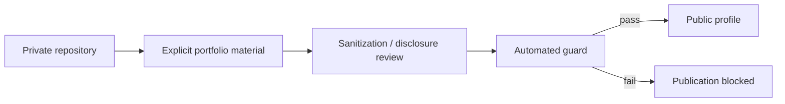

# Private-to-public disclosure model

This profile intentionally separates **public engineering evidence** from **private implementation**.

## Principle

The public portfolio may explain what a system does, how its major boundaries are organized, which technologies are used, which quality mechanisms exist and which trade-offs shaped the architecture.

It must not publish implementation material simply because that material is technically available to the repository owner.

## Allowed by default

- High-level system purpose and product context.
- Sanitized architecture diagrams.
- Publicly safe technology names and platform choices.
- Architectural patterns and engineering principles.
- Test/validation strategy at a non-sensitive level.
- Generic reliability, security and privacy practices.
- Trade-offs that do not expose proprietary algorithms or operational weaknesses.
- Public repositories and public deployment links that were intentionally released.

## Never publish

- Credentials, tokens, API keys, cookies or session material.
- Private keys, certificates or credential-bearing configuration.
- Customer/person data or internal contact information.
- Private infrastructure addresses, internal hostnames or private endpoints.
- Database dumps, local databases, logs or operational exports.
- Proprietary source copied from private repositories.
- Internal incident details, exploitable security findings or bypass instructions.
- Vendor secrets, webhook secrets, OAuth client secrets or signing material.

## Publication path

## Why allowlist thinking

The safe question is not **"what should be removed from the private repository?"**. It is **"what specific material has been deliberately approved for public disclosure?"**

Future automation should therefore export only an explicit portfolio directory or generated manifest. It should never mirror a private repository and then try to remove sensitive files afterward.

## Automated guard

The profile repository runs a lightweight validator on pushes and pull requests. It checks for common secret signatures, credential assignments, private key blocks, sensitive file types and suspicious private-network URLs.

Automated checks reduce accidental exposure but do not replace human review of business-sensitive information.

---

[← Back to profile](../README.md)